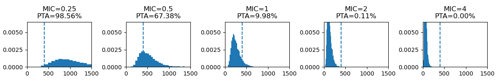

## Introduction

Monte Carlo simulations are widely used in pharmacokinetics to model interindividual variability and predict drug exposure across virtual populations. By repeatedly sampling from parameter distributions, these methods allow estimation of the probability of achieving pharmacodynamic targets under different clinical scenarios.

In the context of antibacterial therapy, this is commonly expressed as the probability of target attainment (PTA), which quantifies the likelihood that a given dosing regimen will achieve a predefined PK/PD index associated with efficacy.

## Simulation Parameters

In this simulation, 10,000 virtual patients were generated to be treated with a 1200 mg dose of vancomycin. A one-compartment model was assumed, where the 24-hour area under the curve (AUC<sub>24</sub>) is approximated as:

$$
{AUC_{24}} = \frac{dose}{Cl}
$$

 This formulation allows variablitiy in renal clearance (Cl) to directly drive differences in drug exposure. Cl was modeled as a log-normal distribution with a mean of 5 L/h and σ = 0.4, reflecting interindividual variability in renal function. Reported population estimates for vancomycin clearance are typically around 4-5 L/h in patients with normal renal function.<sup><a href="#fn1" id="ref1">1</a></sup>
 
 The dosing regimen was evaluated against bacterial strains with minimum inhibitory concentrations (MIC) of 0.25, 0.5, 1, 2 and 4 mg/L. 

Vancomycin efficacy is best described by the $AUC/MIC$ PK/PD index, with a target of ≥400 associated with clinical success<sup><a href="#fn2" id="ref2">2</a></sup>. In contrast, other PK/PD indices, such as $C_{\max}/MIC$ and $T>MIC$, are commonly used for different classes of antibiotics depending on their pharmacodynamic properties. PTA was therefore defined as the proportion of simulated patients achieving AUC/MIC ≥ 400. 

## Results



Testing across increasing MIC values demonstrates a progressive leftward shift in the AUC/MIC distribution, resulting in a sharp decline in PTA. At MIC ≥ 2 mg/L, the probability of achieving the target approaches zero at standard dosing.

This highlights a key clinical challenge: increasing dose may improve PTA, but is constrained by toxicity risk. The balance between efficacy and safety becomes increasingly difficult as MIC rises.

In the following interactive model, the effect of dose escalation at a fixed MIC of 0.5 mg/L is explored.

## Effects of Dose Escalation on Target Attainment

```{python}
from MonteCarloModel import generate_plot
fig = generate_plot()
fig
```

Using the same parameter distributions, MIC was fixed at 0.5 mg/L while dose was varied from 800 mg to 2400 mg.

Increasing dose leads to higher PTA, as expected, since AUC is directly proportional to dose:

$$
\frac{AUC_{24}}{MIC} = \frac{Dose}{Cl \times MIC}
$$

However, variability in exposure also increases with higher dosing, as the effect of clearance variability is amplified. As a result, gains in PTA begin to plateau at higher doses, with progressively smaller improvements despite substantial dose increases.

This demonstrates a key limitation of dose escalation: beyond a certain point, increasing dose yields diminishing returns in PTA.

## PTA Across Dose-MIC Combinations

```{python}
import numpy as np
import plotly.graph_objects as go

sims = 10000
target = 400

doses = np.arange(500, 4000, 250)
MICs = np.linspace(0.25, 3, 20)
#MICs = [0.25, 0.5, 1, 2, 4]

pta_matrix = np.zeros((len(MICs), len(doses)))

for i, mic in enumerate(MICs):
    for j, dose in enumerate(doses):
        Cl = np.random.lognormal(mean=np.log(5), sigma=0.4, size=sims)
        AUC = dose / Cl 
        index = AUC / mic

        pta = (index >= target).mean()
        pta_matrix[i,j] = pta

fig = go.Figure(data=go.Heatmap(
    z=pta_matrix,
    x=doses,
    y=MICs,
    colorbar=dict(title="PTA"),
))

fig.add_trace(go.Contour(
    z=pta_matrix,
    x=doses,
    y=MICs,
    contours=dict(
        start=0.9,
        end=0.9,
        size=0.1,
        coloring='none'
    ),
    showscale=False,
    line=dict(color = "black", width=3, dash='dash'),
))

fig.update_layout(
    title='PTA Across Dose and MIC',
    xaxis_title='Dose (mg)',
    yaxis_title='MIC',
)

fig
```

This heatmap illustrates the relationship between antibiotic dose, MIC, and PTA across the simulated population.

As MIC increases, substantially higher doses are required to maintain PTA ≥ 90% (black line). However, at MIC ≥ 2 mg/L, even aggressive dosing fails to reliably achieve the therapeutic target, entering ranges where toxicity risk becomes clinically significant.

Building on the diminishing returns observed with dose escalation, this visualization shows that for higher MIC values, achieving adequate exposure may be fundamentally unattainable with standard therapy, and support the need for alternative treatment strategies.

## References
<hr></hr>
<sup id="fn1">1. Holford N, O’Hanlon CJ, Allegaert K, Anderson BJ, Falcão A, Simon N, et al. A physiological approach to renal clearance: From premature neonates to adults. British journal of clinical pharmacology. 2024 Apr;90:1066–1080. doi:10.1111/bcp.15978.<a href="#ref1" title="Jump back to footnote 1 in the text.">↩</a></sup><br>

<sup id="fn2">2. Rybak MJ, Le J, Lodise T, Levine D, Bradley J, Liu C, Mueller B, Pai M, Wong-Beringer A, Rotschafer JC, Rodvold K, Maples HD, Lomaestro BM. Executive Summary: Therapeutic Monitoring of Vancomycin for Serious Methicillin-Resistant Staphylococcus aureus Infections: A Revised Consensus Guideline and Review of the American Society of Health-System Pharmacists, the Infectious Diseases Society of America, the Pediatric Infectious Diseases Society, and the Society of Infectious Diseases Pharmacists. J Pediatric Infect Dis Soc. 2020 Jul 13;9(3):281-284. doi: 10.1093/jpids/piaa057. PMID: 32659787; PMCID: PMC7358040.<a href="#ref2" title="Jump back to footnote 2 in the text.">↩</a></sup><br>